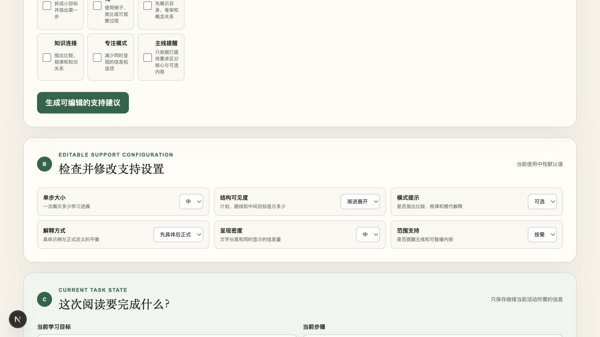

# Learner-Controlled GenAI Scaffolding Demo

这个项目探索学习者如何自己调节 AI 的帮助方式：面对技术材料，自主选择解释方式、步骤大小与信息密度，而不是由系统替学习者贴标签或决定支持强度。它将硕士论文中关于学习者可控 GenAI 支持的设计方向转化为可操作的 RAG 原型；这是工程演示，不是学习效果已获验证的产品。研究背景见[论文与研究材料](https://github.com/03jiang/thesis-genai-neurodiversity)，后续的确认保存与错题复习实践见[数学错题助手](https://github.com/03jiang/math-learning-agent)。

这是一个把技术材料转化为可调节学习支持的全栈演示。用户可以粘贴文本或上传 PDF；后端将 PDF 切块、生成向量并写入 ChromaDB，根据问题检索相关片段，再结合用户可编辑的支持配置调用 DeepSeek，返回解释、下一步行动、可选提示和待确认的状态更新。

## 技术栈

- 前端：Next.js 16、React 19、TypeScript、Tailwind CSS
- 后端：Python 3.12、FastAPI、Pydantic
- 生成模型：DeepSeek，使用 OpenAI 兼容 SDK
- RAG：pypdf、ChromaDB
- Embedding：本地 `BAAI/bge-m3`；部署使用 Voyage `voyage-4-lite`；保留哈希基线
- 测试：pytest、ESLint、Next.js production build

## 快速体验：不下载嵌入模型



*本地真实界面截图，展示六项可编辑支持配置；没有调用模型，也不是生成效果评测。项目展示采用截图和本地运行，不提供公开在线体验地址。*

需要 Node.js 20+、npm 和 Python 3.12。`EMBEDDING_MODE=hash` 使用内置哈希检索基线，配合 `requirements.txt` 即可启动后端，**不下载 bge-m3，也不需要嵌入服务密钥**。它用于检查流程，不代表语义检索质量。

### 1. 启动轻量后端

```bash
git clone https://github.com/03jiang/learner-controlled-rag-demo.git
cd learner-controlled-rag-demo/backend
python3 -m venv .venv
source .venv/bin/activate
python -m pip install -r requirements.txt
EMBEDDING_MODE=hash uvicorn app.main:app --host 127.0.0.1 --port 8000
```

此时不用复制 `.env` 或填写密钥，就能访问[健康检查](http://127.0.0.1:8000/health)和 [API 文档](http://127.0.0.1:8000/docs)，并上传带文本层的 PDF 进行解析、切块和哈希索引。健康检查应返回 `{"status":"ok"}`。

**生成学习支持仍需要 DeepSeek 密钥，可能计费。** `hash` 只替代嵌入计算，不会把语言模型变成本地模拟。没有密钥时，生成接口返回配置提示，不生成假回复。

如需生成，先停止后端；仅在尚无 `.env` 时复制模板：

```bash
test -e .env || cp .env.example .env
```

在本机编辑 `.env`，填入 `DEEPSEEK_API_KEY`、将 `EMBEDDING_MODE` 改为 `hash`，再运行上面的启动命令。不要将密钥写入截图、聊天或 Git。若有旧 `.env`，保留原文件并检查配置。

### 2. 查看前端

另开终端，进入仓库的 `frontend` 目录：

```bash
npm ci
test -e .env.local || cp .env.local.example .env.local
npm run dev -- --hostname 127.0.0.1
```

打开 [本地界面](http://127.0.0.1:3000)。可以先查看和调整支持配置、粘贴材料或上传 PDF；点击生成才需要已配置的 DeepSeek 服务。

若要比较本地语义嵌入，再在后端安装 `requirements-local.txt`，把模式改为 `local`，重启并重新上传 PDF。该模式首次使用会下载 `BAAI/bge-m3`，不属于上面的轻量体验路径。

### 3. 运行测试

后端：

```bash
cd backend
source .venv/bin/activate
python -m pip install -r requirements-dev.txt
PYTHONPATH=. python -m pytest tests -q
```

前端：

```bash
cd frontend
npm run lint
npm run build
```

## 环境变量

完整模板见根目录 `.env.example` 和 `backend/.env.example`。

| 变量 | 说明 | 默认或示例 |
|---|---|---|
| `LLM_PROVIDER` | 生成模型供应商标识 | `deepseek` |
| `DEEPSEEK_API_KEY` | 生成学习支持时必填；启动与哈希索引不需要 | 无 |
| `DEEPSEEK_BASE_URL` | DeepSeek 兼容 API 地址 | `https://api.deepseek.com` |
| `DEEPSEEK_MODEL` | 生成模型名 | `deepseek-v4-flash` |
| `EMBEDDING_MODE` | `hash`、`local` 或 `api` | `local` |
| `EMBEDDING_PROVIDER` | Embedding 供应商说明 | `sentence-transformers` |
| `EMBEDDING_MODEL` | Embedding 模型名 | `BAAI/bge-m3` |
| `EMBEDDING_BASE_URL` | OpenAI 兼容 Embedding API 地址 | API 模式必填 |
| `EMBEDDING_API_KEY` | Embedding API 密钥 | API 模式必填 |
| `EMBEDDING_BATCH_SIZE` | API 每批发送的文本数量 | `64` |
| `EMBEDDING_MAX_RETRIES` | API 失败后的最大重试次数 | `3` |
| `CHUNK_SIZE` | 每个 PDF 片段的字符数 | `1200` |
| `CHUNK_OVERLAP` | 相邻片段重叠字符数 | `180` |
| `TOP_K` | 每次检索返回的片段数 | `5` |
| `BACKEND_URL` | Next.js 服务端访问 FastAPI 的地址 | `http://127.0.0.1:8000` |

修改 Embedding 模式、模型或切块参数后，需要重启后端并重新上传 PDF。若要完全清空索引，可停止后端后删除 `backend/data/chroma/`。

### Embedding 三种运行模式

| 模式 | 用途 | 安装命令 |
|---|---|---|
| `hash` | 无外部依赖的检索基线 | `pip install -r requirements.txt` |
| `local` | 本地开发，使用 `BAAI/bge-m3` | `pip install -r requirements-local.txt` |
| `api` | 可选远程嵌入，需服务密钥 | `pip install -r requirements.txt` |

API 模式以 64 个文本为一批。遇到速率限制、连接失败、超时或 5xx 时最多重试 3 次，按约 1、2、4 秒指数退避，并优先遵循 `Retry-After`。

## 展示与部署边界

本仓库以截图和本地运行作为展示方式。保留的 `render.yaml` 和前端部署配置只是可选配置参考，不表示已经提供可公开使用的服务。当前没有用户认证、速率限制或费用配额控制，不要把连接个人 API 密钥的实例地址放进 README 或简历。需要对外服务时，应先补齐访问控制、配额和费用保护。

## 项目结构

```text
backend/                  FastAPI、模型编排、PDF 解析与 RAG
frontend/                 Next.js 用户界面和后端代理路由
backend/data/chroma/      本地向量索引，不提交 Git
backend/data/models/      本地 Embedding 权重，不提交 Git
docs/images/              本地界面截图
```

## 已知局限

- Embedding 检索质量取决于模型、问题表达、切块参数和文档结构。短而含糊的跨语言问题仍可能命中目录或参考文献；生产系统应考虑查询改写、混合检索和重排序。
- 当前提示词注入防护属于基础防护：材料边界、系统规则和闭合标签转义可以抵御简单注入，但不能保证抵御所有间接提示词注入。生产环境还需要内容检测、权限隔离、输出验证和对抗测试。
- 扫描版 PDF 没有 OCR，只有包含文本层的 PDF 可以被索引。
- ChromaDB 当前使用本地持久化，没有文档删除、租户隔离或生命周期管理。
- 本地 `BAAI/bge-m3` 体积较大，免费部署实例可能内存不足；部署时可切换到远程 Embedding API。
- 当前演示没有用户账户、速率限制、持久化任务状态或生产级监控。
